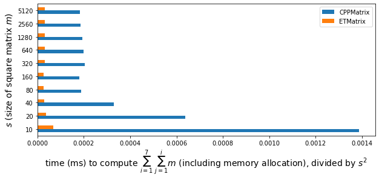
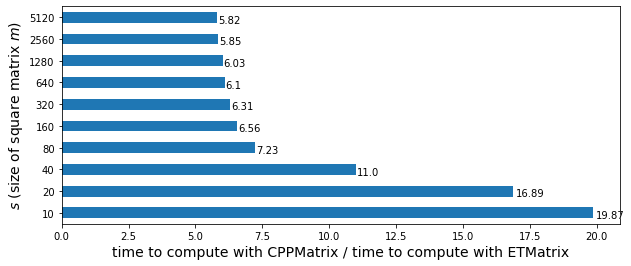
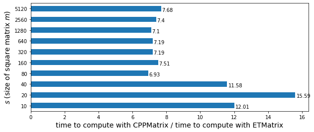

# C++ matrix classes

This repository contains implementations of C++ matrix class. Currently only matrix addition operation is implemented.

- C++ class `CPPMatrix` without expression templates
- C++ class `ETMatrix` with expression templates

A LaTeX graphical illustration I made as a visual explanation of the difference in the approach to evaluation of matrix addition with and without expression templates is as follows.


## Implementation notes

Class definitions can be found in the C++ header files `CPPMatrix.hpp` and `ETMatrix.hpp`. For both `CPPMatrix` and `ETMatrix` classes, the elements are stored in row-major order. 

It is assumed that the lengths/sizes of all initializer lists (one initializer list for a row) are the same for a matrix, i.e. a matrix supplied to the constructor for `CPPMatrix` or `ETMatrix` is rectangular and well-formed, and therefore checking is not performed in that regard.

Since the scale of this project is small, for simplicity, all files are stored in the root folder of the repository, and `namespace`s are not declared in the code.

In `CPPMatrix`, `std::plus` and  `std::transform` are used along with operator overloading to implement the addition operation for two matrices. As an alternative, C++20 features may be used.

## Demo

To run the demo, use the command `make demo`.

The classes `CPPMatrix` and `ETMatrix` provide compatible interfaces and hence they are interchangeable. The code for the printing facility for both matrix classes is included for debugging purposes. See demonstration in `print.cpp`.

## Benchmark

To run the benchmark, use the command `make run`. Note that the command would compile C++ programs with `-O3` optimization turned on.

For benchmarking, type `double` square matrices with increasing sizes are randomly generated, and the performance of matrix addition with `CPPMatrix` and `ETMatrix` is measured. Note that the matrices generated are random and not necessarily the same for the benchmarking of `ETMatrix` and `CPPMatrix`.

For different sizes of matrix `m` constructed from data randomly generated and stored in `vv`, the running time in milliseconds for the following code snippet with matrix class type T
```
T m(vv);
T msum;
msum = m + (m + m) + (m + m + m) + (m + m + m + m) + (m + m + m + m + m)
	+ (m + m + m + m + m + m) + (m + m + m + m + m + m + m);
```
can be observed from the output of the command `make run` running on Arch Linux on a single thread of an AMD A8 Piledriver processor.

```
g++ -std=c++14 -o ./benchmark ./benchmark.cpp
./benchmark
CPPMatrix
10 0.138753ms
20 0.255431ms
40 0.526563ms
80 1.21358ms
160 4.66485ms
320 20.8913ms
640 82.0911ms
1280 317.967ms
2560 1214.29ms
5120 4784.7ms
ETMatrix
10 0.006982ms
20 0.01512ms
40 0.047863ms
80 0.167892ms
160 0.711511ms
320 3.30981ms
640 13.4519ms
1280 52.7425ms
2560 207.473ms
5120 822.663ms
```

The time in milliseconds to compute the expression `msum` (including the time to allocate memory for `m` and `msum` but not including the time to generate random element values) is then divided by the square of the size of matrix `m` (i.e. the number of elements in matrix `m`) to obtain the following bar plot.



The factor of speed up in using expression templates matrix `ETMatrix` over `CPPMatrix` converges to 5 as the matrix size grows.



The same benchmark running on Arch Linux on a single thread of an Intel Core i5 processor gives similar results. However, more iterations of benchmark are needed to average out the noise as observed in the following graphs generated from the output.




Note that the expression `msum` evaluated is hardcoded in the benchmark. Benchmarking code for investigation of the effect of the length and complexity of the expression on the performance of evaluation is yet to be done.
