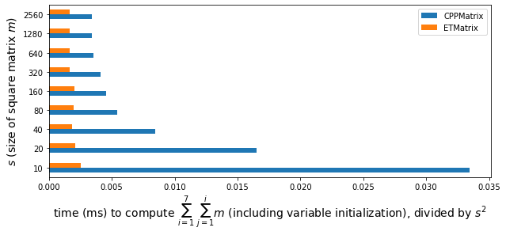

# C++ matrix classes

This repository contains the C++ matrix classes `CPPMatrix` and `ETMatrix`. Only matrix addition operation is implemented.

## Implementation notes

Class definitions can be found in the C++ header files `CPPMatrix.hpp` and `ETMatrix.hpp`. For both `CPPMatrix` and `ETMatrix` classes, the elements are stored in row-major order. 

It is assumed that the lengths/sizes of all initializer lists (one initializer list for a row) are the same for a matrix, i.e. a matrix supplied to the constructor for `CPPMatrix` or `ETMatrix` is rectangular and well-formed, and therefore checking is not performed in that regard.

Since the scale of this project is small, for simplicity, all files are stored in the root folder of the repository, and `namespace`s are not declared in the code.

In `CPPMatrix`, `std::plus` and  `std::transform` are used along with operator overloading to implement the addition operation for two matrices. As an alternative, C++20 features may be used.

## Demo

To run the demo, use the command `make demo`.

The classes `CPPMatrix` and `ETMatrix` provide compatible interfaces and hence they are interchangeable. The code for the printing facility for both matrix classes is included for debugging purposes. See demonstration in `print.cpp`.

## Benchmark

To run the benchmark, use the command `make run`.

For benchmarking, type `double` square matrices with increasing sizes are randomly generated, and the performance of matrix addition with `CPPMatrix` and `ETMatrix` is measured. Note that the matrices generated are random and not necessarily the same for the benchmarking of `ETMatrix` and `CPPMatrix`.

For different sizes of matrix `m` constructed from data randomly generated and stored in `vv`, the running time in milliseconds for the following code snippet with matrix class type T
```
T m(vv);
T msum;
msum = m + (m + m) + (m + m + m) + (m + m + m + m) + (m + m + m + m + m)
	+ (m + m + m + m + m + m) + (m + m + m + m + m + m + m);
```
can be observed from the output of the command `make run`, which shows that **`ETMatrix` with expression templates is over 2x more performant than `CPPMatrix`** for all matrix sizes tested.

```
g++ -std=c++14 -o ./benchmark ./benchmark.cpp
./benchmark
CPPMatrix
10 3.34575ms
20 6.60417ms
40 13.5116ms
80 34.8754ms
160 116.838ms
320 418.349ms
640 1464.65ms
1280 5638.13ms
2560 22200.2ms
ETMatrix
10 0.256554ms
20 0.826062ms
40 2.98548ms
80 12.7522ms
160 51.4254ms
320 171.277ms
640 679.507ms
1280 2708ms
2560 10845.4ms
```

The time in milliseconds to compute the expression `msum` (including the time to initialize variables `m` and `msum` but not including the time to generate random element values) is then divided by the square of the size of matrix `m` (i.e. the number of elements in matrix `m`) to obtain the following bar plot.



Note that the expression `msum` evaluated is hardcoded in the benchmark. Benchmarking code for investigation of the effect of the length and complexity of the expression on the performance of evaluation is yet to be done.

